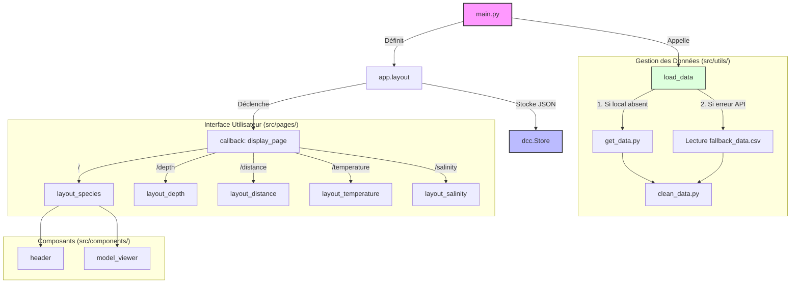

# WhaLife
## User Guide
First, clone the repository:
```bash
git clone https://github.com/lou-kail/WhaLife.git
cd WhaLife
```
It is necessary to install the required libraries before installation:
```bash
pip install -r requirements.txt
```
To run the code simply type the following command at the root of the project:
```bash
python3 main.py # or "python main.py"
```
## Data
[Data source page](https://obis.org/)
- [Humpback Whales](https://obis.org/taxon/137092)
- [Blue Whales](https://obis.org/taxon/137090)
- [Dolphins](https://obis.org/taxon/137102)
- [Orcas](https://obis.org/taxon/137094)

The data comes from the Ocean Biodiversity Information System (**OBIS**) and gathers data on numerous cetaceans.
We only process data concerning **Humpback Whales**, **blue whales**, **orcas** and **dolphins**.
It is then possible to analyze the population of a species according to **years**, their **location**, the **depth** at which the animal was detected, the **distance from the coasts**, the **water temperature** and the **water salinity**.

A fallback dataset is included in case the app is first launched without access to the internet. Once back online, it will default to the downloaded dataset and keep a local copy.
## Developer Guide

```text
WhaLife/
├── app.py                 # Application entry point & routing logic
├── config.py              # Global settings (Taxon IDs, constants)
├── assets/                # Static resources (3D Models .glb, CSS, Images, and a minified JS lib.)
├── data/                  # Data storage (Raw, Cleaned, Fallback)
├── src/
│   ├── components/        # Reusable UI components (Map, Header, etc.)
│   ├── pages/             # Page-specific layouts and callbacks
│   └── utils/             # Data processing (Fetch, Cleaning)
├── requirements.txt       # Project dependencies
└── README.md              # Project documentation
```
The project is structured in a modular way:
- **main.py**: Application entry point. Manages dashboard initialization, data loading and routing.
- **config.py**: Contains global constants (taxon IDs, descriptive texts).
- **src/components/**: Contains reusable interface elements (Header, Map, Histogram, 3D Visualizer).
- **src/pages/**: Contains layouts specific to each analysis page (species.py, depth.py, etc.).
- **src/utils/**: Contains API retrieval and Pandas cleaning scripts.
- **assets/**: Contains project resources (CSS, 3D models, images).
## Analysis Report
- **Distribution**: The dashboard highlights on a map that the different species have very different living environments. For example, dolphins seem to live near American, European and Australian coasts while orcas have a very wide distribution particularly in the Pacific Ocean.
- **Temperature**: The analysis of sea surface temperatures (SST) shows the distinct thermal preferences between polar and temperate species.
- **Depth**: The depth graphs make it possible to distinguish coastal species from species that frequent deep waters.
## Copyright
We declare on our honor that the code and assets provided were produced by us, Lou Kail and Théo Séré, with the exception of the elements below:
- **Third-party libraries**: The application relies on the open-source libraries [Dash](https://dash.plotly.com/), [Pandas](https://pandas.pydata.org/), [Plotly](https://plotly.com/python/) and [<model-viewer>](https://modelviewer.dev/).
- **Font**: The imported font is Gluten, retrieved from [Google Fonts](https://fonts.google.com/specimen/Gluten)
- **3D models**: The .glb files present in the assets/ folder (whales ([humpback](https://skfb.ly/oHQvR) and [blue](https://skfb.ly/67RFV)), [orcas](https://skfb.ly/THDz), [dolphins](https://skfb.ly/oRv8t)) are illustrative models.
- **Data**: The data comes from OBIS.
- **API Snippet**: The API connection logic in src/utils/get_data.py is inspired by the official [OBIS API documentation](https://api.obis.org/).
  
Any line not declared above is deemed to be produced by Lou Kail and Théo Séré. The absence or omission of declaration will be considered plagiarism.
